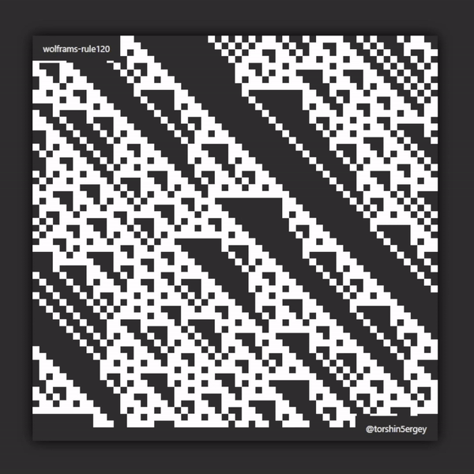

# Wolfram's Rules with p5.js

Stephen's Wolfram elementary cellular automations in JavaScript using p5.js.




## Description

This project visualizes [Wolfram's Rules](https://en.wikipedia.org/wiki/Rule_30), a one-dimensional binary cellular automatons identified by Stephen Wolfram. The rules is applied to a string of cells, each of which can be either 0 (white) or 1 (black). The state of each cell in the next generation depends on its current state and the state of its two immediate neighbors. There are following rules:
- [Rule 184](https://en.wikipedia.org/wiki/Rule_184)
- [Rules 30, 120, 135, 225](https://en.wikipedia.org/wiki/Rule_30)

## Rules

**Rule 30**
| Current Pattern | 111 | 110 | 101 | 100 | 011 | 010 | 001 | 000 |
|:---------------:|:---:|:---:|:---:|:---:|:---:|:---:|:---:|:---:|
| New state       | 0   | 0   | 0   | 1   | 1   | 1   | 1   | 0   |

**Rule 120**
| Current Pattern | 111 | 110 | 101 | 100 | 011 | 010 | 001 | 000 |
|:---------------:|:---:|:---:|:---:|:---:|:---:|:---:|:---:|:---:|
| New state       | 0   | 1   | 1   | 1   | 1   | 0   | 0   | 0   |

**Rule 135**
| Current Pattern | 111 | 110 | 101 | 100 | 011 | 010 | 001 | 000 |
|:---------------:|:---:|:---:|:---:|:---:|:---:|:---:|:---:|:---:|
| New state       | 1   | 0   | 0   | 0   | 0   | 1   | 1   | 1   |

**Rule 184**
| Current Pattern | 111 | 110 | 101 | 100 | 011 | 010 | 001 | 000 |
|:---------------:|:---:|:---:|:---:|:---:|:---:|:---:|:---:|:---:|
| New state       | 1   | 0   | 1   | 1   | 1   | 0   | 0   | 0   |

**Rule 225**
| Current Pattern | 111 | 110 | 101 | 100 | 011 | 010 | 001 | 000 |
|:---------------:|:---:|:---:|:---:|:---:|:---:|:---:|:---:|:---:|
| New state       | 1   | 1   | 1   | 0   | 0   | 0   | 0   | 1   |

## View Online

You can also view this project online in p5js Web Editor:
- [Rule 184](https://editor.p5js.org/torshin5ergey/full/CHG4PIw2g)
- [Rule 30, 120, 135, 225](https://editor.p5js.org/torshin5ergey/full/CHG4PIw2g)
This projects also available on its project page [here](https://torshin5ergey.github.io/cellular-automata/wolframs-rules/index.html).

## How to Use in Your Project

1. Clone the repository to your computer.
2. Include `p5.js` in your project.
3. Import `cellular-automata/wolframs-rules/sketch_name.js` into your project and use it in your code.
4. Customize.
    - If needed, you may need to adjust the following lines in the `sketch_name.js` file to fit your desired canvas size or    container element:
        ```javascript
        let canvas = createCanvas(windowWidth, windowHeight);
        canvas.parent("canvas");
        ```
    - You can modify the dimensions passed to `createCanvas()` to adjust the size of the canvas. Additionally, you may need to change the parent element ID passed to `canvas.parent()`. Alternatively, you can use the following line and comment out the two lines above to use a fixed canvas size:
        ```javascript
        createCanvas(CANVAS_W, CANVAS_H);
        ```
        Change `CANVAS_W` and `CANVAS_H` with the desired width and height of the canvas.

## License

Shield: [![CC BY-NC-SA 4.0][cc-by-nc-sa-shield]][cc-by-nc-sa]

This work is licensed under a
[Creative Commons Attribution-NonCommercial-ShareAlike 4.0 International License][cc-by-nc-sa].

[![CC BY-NC-SA 4.0][cc-by-nc-sa-image]][cc-by-nc-sa]

[cc-by-nc-sa]: http://creativecommons.org/licenses/by-nc-sa/4.0/
[cc-by-nc-sa-image]: https://licensebuttons.net/l/by-nc-sa/4.0/88x31.png
[cc-by-nc-sa-shield]: https://img.shields.io/badge/License-CC%20BY--NC--SA%204.0-lightgrey.svg

## Author

Sergey Torshin [@torshin5ergey](https://github.com/torshin5ergey)
